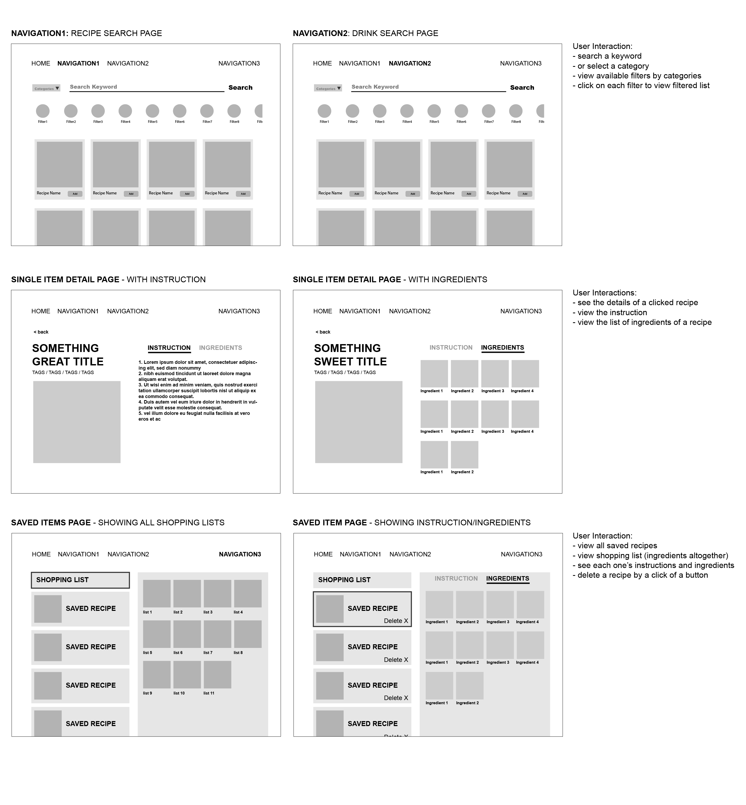

# React Part Time Class Final Project

## Project Links

- [CodeSandbox Link](https://codesandbox.io/s/react-final-ashley-8v6d04)

## Project Description

A guiding website that helps users to plan and prep dinners, including food recipes and cocktail recipes.


## Wireframes
- [external link to Wireframes](./images/react-final-wireframe.png)

- [React Architecture]()


#### MVP 
- Pull available data from [TheMealDB](https://www.themealdb.com/api.php) & [TheCocktailDB](https://www.thecocktaildb.com/api.php) APIs
- Home page with several navigations
- Recipe detail page with food image, instructions, and ingredients
- Favorite page where users can all saved recipes are shown
- Ability for user to searcch for a recipe
- Ability for user to filter out by categories
- Ability for user to save a recipe
- Ability for user to delete a recipe from favorite recipe list

#### PostMVP EXAMPLE

- Make tags clickable
- Make it responsive design for mobile, tablet, and desktop screens sizes.
- Utilize other APIs to add more information of the recipe, such as calories, prep time, or nutritions.

## API

- [TheMealDB](https://www.themealdb.com/api.php)
- [TheCocktailDB](https://www.thecocktaildb.com/api.php)


```json
{
"meals": [
	{
	"idMeal": "52807",
	"strMeal": "Baingan Bharta",
	"strDrinkAlternate": null,
	"strCategory": "Vegetarian",
	"strArea": "Indian",
	"strInstructions": "Rinse the baingan (eggplant or aubergine) in water. Pat dry with a kitchen napkin. Apply some oil all over and\r\nkeep it for roasting on an open flame. You can also grill the baingan or roast in the oven. But then you won't get\r\nthe smoky flavor of the baingan. Keep the eggplant turning after a 2 to 3 minutes on the flame, so that its evenly\r\ncooked. You could also embed some garlic cloves in the baingan and then roast it.\r\n2. Roast the aubergine till its completely cooked and tender. With a knife check the doneness. The knife should slid\r\neasily in aubergines without any resistance. Remove the baingan and immerse in a bowl of water till it cools\r\ndown.\r\n3. You can also do the dhungar technique of infusing charcoal smoky flavor in the baingan. This is an optional step.\r\nUse natural charcoal for this method. Heat a small piece of charcoal on flame till it becomes smoking hot and red.\r\n4. Make small cuts on the baingan with a knife. Place the red hot charcoal in the same plate where the roasted\r\naubergine is kept. Add a few drops of oil on the charcoal. The charcoal would begin to smoke.\r\n5. As soon as smoke begins to release from the charcoal, cover the entire plate tightly with a large bowl. Allow the\r\ncharcoal smoke to get infused for 1 to 2 minutes. The more you do, the more smoky the baingan bharta will\r\nbecome. I just keep for a minute. Alternatively, you can also do this dhungar method once the baingan bharta is\r\ncooked, just like the way we do for Dal Tadka.\r\n6. Peel the skin from the roasted and smoked eggplant.\r\n7. Chop the cooked eggplant finely or you can even mash it.\r\n8. In a kadai or pan, heat oil. Then add finely chopped onions and garlic.\r\n9. Saute the onions till translucent. Don't brown them.\r\n10. Add chopped green chilies and saute for a minute.\r\n11. Add the chopped tomatoes and mix it well.\r\n12. Bhuno (saute) the tomatoes till the oil starts separating from the mixture.\r\n13. Now add the red chili powder. Stir and mix well.\r\n14. Add the chopped cooked baingan.\r\n15. Stir and mix the chopped baingan very well with the onion­tomato masala mixture.\r\n16. Season with salt. Stir and saute for some more 4 to 5 minutes more.\r\n17. Finally stir in the coriander leaves with the baingan bharta or garnish it with them. Serve Baingan Bharta with\r\nphulkas, rotis or chapatis. It goes well even with bread, toasted or grilled bread and plain rice or jeera rice.",
	"strMealThumb": "https://www.themealdb.com/images/media/meals/urtpqw1487341253.jpg",
	"strTags": "Spicy,Bun,Calorific",
	"strYoutube": "https://www.youtube.com/watch?v=-84Zz2EP4h4",
	"strIngredient1": "Aubergine",
	"strIngredient2": "Onion",
	"strIngredient3": "Tomatoes",
	"strIngredient4": "Garlic",
	"strIngredient5": "Green Chili",
	"strIngredient6": "Red Chili Powder",
	"strIngredient7": "Oil",
	"strIngredient8": "Coriander Leaves",
	"strIngredient9": "salt",
	"strIngredient10": "",
	"strIngredient11": "",
	"strIngredient12": "",
	"strIngredient13": "",
	"strIngredient14": "",
	"strIngredient15": "",
	"strIngredient16": "",
	"strIngredient17": "",
	"strIngredient18": "",
	"strIngredient19": "",
	"strIngredient20": "",
	"strMeasure1": "1 large",
	"strMeasure2": "½ cup ",
	"strMeasure3": "1 cup",
	"strMeasure4": "6 cloves",
	"strMeasure5": "1",
	"strMeasure6": "¼ teaspoon",
	"strMeasure7": "1.5 tablespoon",
	"strMeasure8": "1 tablespoon chopped",
	"strMeasure9": "as required",
	"strMeasure10": "",
	"strMeasure11": "",
	"strMeasure12": "",
	"strMeasure13": "",
	"strMeasure14": "",
	"strMeasure15": "",
	"strMeasure16": "",
	"strMeasure17": "",
	"strMeasure18": "",
	"strMeasure19": "",
	"strMeasure20": "",
	"strSource": "http://www.vegrecipesofindia.com/baingan-bharta-recipe-punjabi-baingan-bharta-recipe/",
	"strImageSource": null,
	"strCreativeCommonsConfirmed": null,
	"dateModified": null
	}
]
}
```

## Components
##### Writing out your components and its descriptions isn't a required part of the proposal but can be helpful.

Based on the initial logic defined in the previous sections try and breakdown the logic further into stateless/stateful components. 

| Component | Description | 
| --- | :---: |  
| App | This will make the initial data pull and include React Router| 
| FoodPage | This will render the header include the nav | 
| DrinkPage | This will render the header include the nav | 
| SavedPage | This will render a page where all saved food & drink recipe cards are displayed | 
| FoodDetail | This will render a page where it includes selected food recipe details | 
| DrinkDetail | This will render a page where it includes selected drink recipe details| 
| RecipeCard | This will render either food & drink recipe card inside FoodPage & DrinkPage Components | 
| SearchForm | This will render a search form inside FoodPage & DrinkPage Components. | 


## Additional Libraries


## Code Snippet


```jsx
// filtering through recipes
  let search = "chicken";
  let foodType = "Indian";

  fetch("https://www.themealdb.com/api/json/v1/1/search.php?s=" + search)
    .then((data) => data.json())
    .then((jsonData) => {
      let foodArr = jsonData.meals;
      let filtered = foodArr.filter((food) => food.strArea === foodType);
      console.log(filtered);
    });
```
